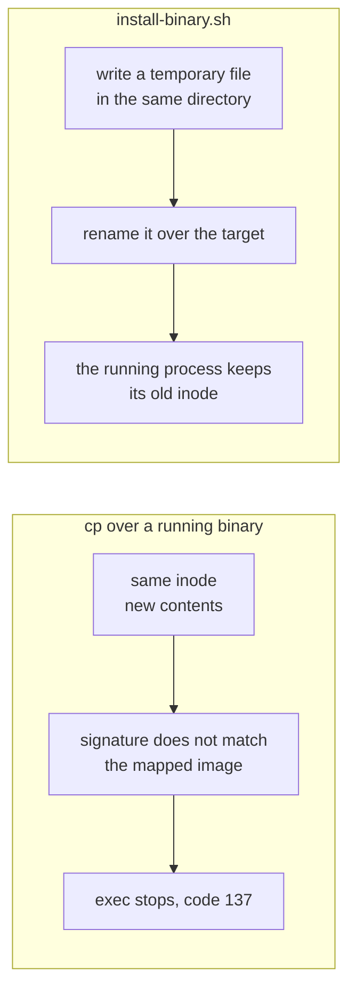

## Install from source

```bash
make install                      # installs to ~/.local/bin/proem
make install PREFIX=/usr/local    # installs to /usr/local/bin/proem
```

## Install from a release

Each [release](https://github.com/barockok/proem/releases) has binaries for
Linux and macOS, and a `checksums.txt` file.

```bash
gh release download v0.3.2 --repo barockok/proem
shasum -a 256 -c checksums.txt
./scripts/install-binary.sh ./proem-darwin-arm64 ~/.local/bin/proem
```

## Why you must not use cp

Do not use `cp` to replace a binary that is running. `cp` writes into the same
inode. On macOS the code signature then does not match the image that the
kernel mapped. The path stops running and exits with code 137. The kernel stops
a running service with the reason `OS_REASON_CODESIGNING`.



`scripts/install-binary.sh` writes a temporary file in the destination
directory. `rename(2)` is atomic only inside one filesystem, so the temporary
file must be there. The script then renames that file over the target. The
running process keeps the old inode and continues. The next start reads the new
file.

The script also signs a binary that arrives without a signature. A
`darwin/amd64` binary that you build on Linux has no signature.

## macOS

CI signs the released macOS binaries with an ad-hoc signature, so they run on
Apple Silicon as you download them.

macOS marks any file that a **browser** downloads. To remove that mark:

```bash
xattr -d com.apple.quarantine ./proem-darwin-arm64
```

Files that you download with `curl` or `gh release download` do not carry the
mark. The binaries are not notarised, so Gatekeeper does not report them as
identified.

## Run Proem as a service

Proem is one process and keeps no state on local disk, so any supervisor can
run it. This is a launchd agent on macOS:

```xml
<key>ProgramArguments</key>
<array>
  <string>/Users/you/.local/bin/proem</string>
  <string>--config</string>   <string>/Users/you/.proem/pool.yaml</string>
  <string>--clients</string>  <string>/Users/you/.proem/clients.yaml</string>
  <string>--redis-url</string><string>redis://127.0.0.1:6379/0</string>
  <string>--listen</string>   <string>127.0.0.1:8788</string>
  <string>--metrics-addr</string><string>127.0.0.1:8789</string>
  <string>--log-format</string><string>json</string>
</array>
<key>RunAtLoad</key><true/>
<key>KeepAlive</key><true/>
```

Bind to `127.0.0.1` to keep the proxy and its metrics off the network.

Proem reloads its configuration after a change, so you do not restart the
service when you add a member or revoke a client.
