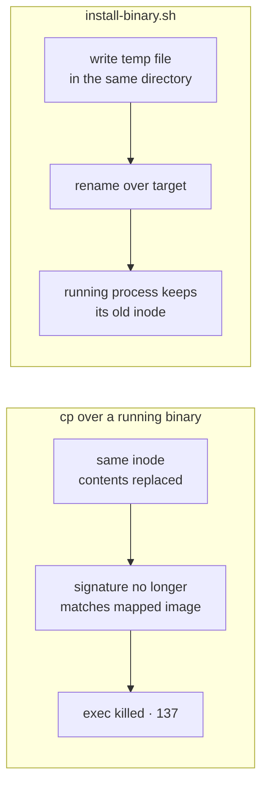

## From source

```bash
make install                      # ~/.local/bin/proem
make install PREFIX=/usr/local    # /usr/local/bin/proem
```

## From a release

Binaries for Linux and macOS are attached to each
[release](https://github.com/barockok/proem/releases), with `checksums.txt`.

```bash
gh release download v0.3.2 --repo barockok/proem
shasum -a 256 -c checksums.txt
./scripts/install-binary.sh ./proem-darwin-arm64 ~/.local/bin/proem
```

## Why not `cp`

Upgrading with `cp` over a binary that is currently running will break it.
Copying in place reuses the file's inode, and macOS then holds a code signature
that no longer matches the image it mapped. The path stops being executable —
it exits `137` — and a running service is killed with `OS_REASON_CODESIGNING`.



`scripts/install-binary.sh` writes to a temporary file **in the destination
directory** — `rename(2)` is only atomic within one filesystem — then renames
over the target. The running process keeps the old inode and carries on; the
next start picks up the new file. It also ad-hoc signs anything that arrives
unsigned, which a locally built `darwin/amd64` binary otherwise is.

## macOS

Released darwin binaries are ad-hoc signed in CI, so they run on Apple Silicon
as downloaded. macOS still quarantines anything fetched with a **browser**:

```bash
xattr -d com.apple.quarantine ./proem-darwin-arm64
```

Downloads made with `curl` or `gh release download` are not quarantined. The
binaries are not notarised, so Gatekeeper will not treat them as identified.

## Running as a service

Proem is a single process with no local state, so any supervisor works. A
launchd agent on macOS:

```xml
<key>ProgramArguments</key>
<array>
  <string>/Users/you/.local/bin/proem</string>
  <string>--config</string>   <string>/Users/you/.proem/pool.yaml</string>
  <string>--clients</string>  <string>/Users/you/.proem/clients.yaml</string>
  <string>--redis-url</string><string>redis://127.0.0.1:6379/0</string>
  <string>--listen</string>   <string>127.0.0.1:8788</string>
  <string>--metrics-addr</string><string>127.0.0.1:8789</string>
  <string>--log-format</string><string>json</string>
</array>
<key>RunAtLoad</key><true/>
<key>KeepAlive</key><true/>
```

Binding to `127.0.0.1` keeps both the proxy and its metrics off the network.
Configuration is hot-reloaded, so adding a member or revoking a client does not
need a restart.
