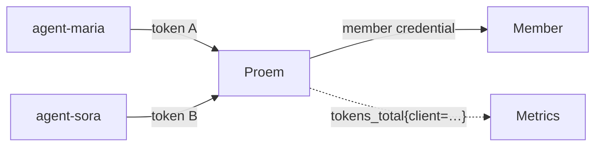

Each client has its own token. Proem uses the token to decide whether it
accepts the request. Proem also uses the client name as the attribution label
on usage metrics. A client never holds a member credential.



## Issue a token

```bash
proem issue-token agent-maria
```

Proem prints the token one time and does not store it. Proem stores only the
SHA-256 digest of the token in `clients.yaml`. That file is therefore not a
secret, and a copy of it does not give access to the proxy. If you lose a
token, issue a new one and replace the entry.

An issued token starts with `sk-ant-oat01-`. Some clients read the shape of a
credential to decide which header to use, and Claude Code is one of them. The
prefix makes those clients send a bearer token. Proem itself reads the token
from the `Authorization` header or the `x-api-key` header, whatever its shape.

## The clients file

```yaml
clients:
  - name: agent-maria
    tokenSHA256: 0000000000000000000000000000000000000000000000000000000000000001

  - name: agent-sora
    tokenSHA256: 0000000000000000000000000000000000000000000000000000000000000002

  - name: agent-retired
    tokenSHA256: 0000000000000000000000000000000000000000000000000000000000000003
    enabled: false
```

| Field | Meaning |
|---|---|
| `name` | The attribution label. Use letters, digits, `.`, `_` and `-`. The limit is 64 characters. |
| `tokenSHA256` | The hex SHA-256 digest of the token. It must be unique. |
| `enabled` | The default is true. Set it to `false` to revoke access and keep the record. |

Proem rejects a duplicate name, a duplicate token, a digest that is not valid
hex, and an empty list. You can write the file as YAML or as JSON. Proem
reloads it after a change. If a change fails validation, Proem keeps the
registry that is already running, so a mistake cannot lock out every client.

**Proem is fail-closed.** It does not start without a client registry. It
refuses every request that does not carry a known token. There is no anonymous
access.

## What a client receives

| Condition | Status | Error type |
|---|---|---|
| No `Authorization` header and no `x-api-key` header | 401 | `authentication_error` |
| The token is not in the registry | 401 | `authentication_error` |
| The client is known and `enabled` is false | 403 | `permission_error` |

Proem returns errors in the Anthropic shape, so an SDK reports them as
authentication failures:

```json
{
  "type": "error",
  "error": {
    "type": "authentication_error",
    "message": "invalid credentials: this token is not registered with the proxy"
  }
}
```

Proem answers `/health` and `/api/hello` without authentication, so load
balancer probes and client reachability checks do not need a token.

## Attribute usage

```promql
# what each client used in a day, cache included
sum by (client) (increase(proem_tokens_total[24h]))

# which client causes failovers
sum by (client) (rate(proem_failovers_total[5m]))

# p95 latency for each client
histogram_quantile(0.95,
  sum by (le, client) (rate(proem_upstream_latency_seconds_bucket[5m])))
```

[Observability](observability.md) lists every metric and explains the number of
series that these labels create.

## Rotate and revoke

To rotate a token:

1. Issue a new token.
2. Add it as a second entry.
3. Move the client to the new token.
4. Delete the old entry.

To revoke a token now, set `enabled: false` or delete the entry, then save the
file. Proem refuses the next request from that client. You do not restart
Proem.

Metrics keep the old client name after you remove a client, so past usage stays
attributed.
