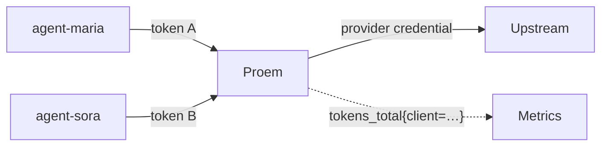

Every caller is issued its own token. Proem uses it to decide whether the
request is allowed, and as the attribution label on usage metrics. Callers never
hold a provider credential.



## Issue a token

```bash
proem issue-token agent-maria
```

The raw token is printed **once** and never stored. Only its SHA-256 digest
goes into `clients.yaml`, so that file is not itself a secret and a leaked copy
cannot be used to call the proxy. If a token is lost, issue a new one and
replace the entry.

Issued tokens carry the `sk-ant-oat01-` prefix so that clients which inspect
the shape of a credential — Claude Code among them — treat it as a bearer
token. Proem itself accepts the token from either `Authorization: Bearer` or
`x-api-key`, whatever its shape.

## clients.yaml

```yaml
clients:
  - name: agent-maria
    tokenSHA256: 6bc4a596d198c83d80bd44a4e46e3f4007e12a35a086a8452abf9f79b0ec1f66

  - name: agent-sora
    tokenSHA256: 2c26b46b68ffc68ff99b453c1d30413413422d706483bfa0f98a5e886266e7ae

  - name: agent-retired
    tokenSHA256: 9f86d081884c7d659a2feaa0c55ad015a3bf4f1b2b0b822cd15d6c15b0f00a08
    enabled: false
```

| Field | Meaning |
|---|---|
| `name` | Attribution label. Alphanumeric plus `.`, `_`, `-`, max 64 characters |
| `tokenSHA256` | Hex SHA-256 digest of the issued token. Must be unique |
| `enabled` | Default true. `false` revokes access while keeping the record |

Duplicate names, duplicate tokens, malformed digests and an empty list are all
rejected. Like the pool, the registry may equally be written as JSON, and it is
hot-reloaded — a rejected edit leaves the previous registry in force, so a typo
cannot lock every caller out.

**Proem is fail-closed.** It will not start without a client registry, and any
request without a recognised token is refused. There is no anonymous mode.

## What callers see

| Situation | Status | Error type |
|---|---|---|
| No `Authorization` or `x-api-key` | 401 | `authentication_error` |
| Token not in the registry | 401 | `authentication_error` |
| Known client, `enabled: false` | 403 | `permission_error` |

Errors use the Anthropic envelope, so SDKs surface them as authentication
failures rather than opaque proxy errors:

```json
{
  "type": "error",
  "error": {
    "type": "authentication_error",
    "message": "invalid credentials: this token is not registered with the proxy"
  }
}
```

`/health` and `/api/hello` are answered locally without authentication, so
load balancer probes and client reachability checks do not need a token.

## Attribution

```promql
# consumption per caller over a day, cache included
sum by (client) (increase(proem_tokens_total[24h]))

# which caller is driving failovers
sum by (client) (rate(proem_failovers_total[5m]))

# p95 latency per caller
histogram_quantile(0.95,
  sum by (le, client) (rate(proem_upstream_latency_seconds_bucket[5m])))
```

See [observability](observability.md) for the full metric list and the cardinality
this implies.

## Rotating and revoking

- **Rotate:** issue a new token, add it as a second entry, move the caller
  across, then delete the old entry.
- **Revoke now:** set `enabled: false` or delete the entry and save. The next
  request from that caller is refused; no restart.

Historical metrics keep the old client name, so past usage stays attributable
after a caller is removed.
