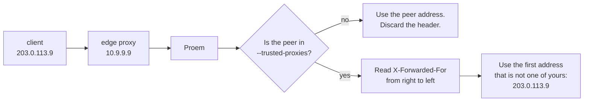

## What Proem never logs

Proem does not log request bodies or response bodies. A request body carries a
prompt. A response body carries a completion. Both can contain anything that
the client sent.

| Proem never logs | Reason |
|---|---|
| The request body | It contains prompts and user data. |
| The response body | It contains completions. |
| The URL query string | A client can put anything in it. Proem logs the path only. |
| Client tokens | Proem logs a 12-character fingerprint of a rejected token. |
| Member credentials | Logging never reads them. |

Proem logs a rejected token as `token_fp`. This is the first 12 hex characters
of the SHA-256 digest of the token. The fingerprint separates one wrong token
that arrives 500 times from 500 different wrong tokens. It does not record the
token.

## Access log

Proem writes one line for each request, after the request completes. Proem does
not log `/health`, so probe traffic stays out of the log.

```json
{"time":"2026-09-03T08:27:08Z","level":"INFO","msg":"request","method":"POST",
 "path":"/v1/messages","status":200,"duration_ms":1180,"bytes":3914,
 "client":"agent-maria","ip":"203.0.113.77","user_agent":"claude-cli/2.1.258"}
```

Use `--access-log=false` to stop the access log. Use `--log-format json` to
select JSON. The default format is `text`.

## Authentication failures

Proem counts and logs every rejection at level `WARN`.

```promql
sum by (reason) (rate(proem_auth_failures_total[5m]))
```

| `reason` | Meaning |
|---|---|
| `missing_credentials` | The request had no `Authorization` header and no `x-api-key` header. |
| `unknown_token` | The token is not in the registry. The log line includes `token_fp`. |
| `client_disabled` | The client is known and `enabled` is false. The log line includes `client`. |

A steady rate of `unknown_token` means that someone tries to guess a token. A
sudden rate of `missing_credentials` usually means that a client started
without its token.

## Client IP behind a proxy

A client sends the `X-Forwarded-For` header, and a client can therefore forge
it. Proem reads that header only when the peer is a proxy that you name:

```bash
proem --trusted-proxies '10.0.0.0/8,192.168.1.1'
```



Proem reads the header from right to left. The rightmost entries are the ones
that your own proxies added, so a client cannot win by adding an entry at the
start.

If you do not set `--trusted-proxies`, Proem ignores the header and uses the
peer address. This is correct when clients reach Proem directly.

Set this option to the address range of your load balancer. If you leave it
empty behind a proxy, Proem logs the address of the load balancer for every
request. If you set it too wide, a client can forge its own address.

## Metrics

Read metrics from port 9090 at `/metrics`. [Metrics](../reference/metrics.md)
lists every series and the number of series that the labels create.
