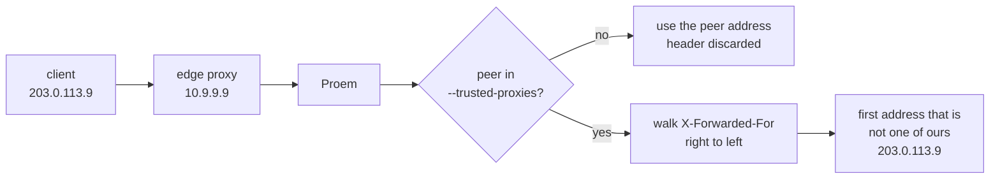

## What is never logged

Bodies are never recorded, in either direction. Requests carry prompts and
responses carry completions, and both may contain anything the caller put in
them.

| Never logged | Why |
|---|---|
| Request body | prompts, user data |
| Response body | completions |
| URL query string | callers can put anything there; only the path is logged |
| Client tokens | a rejected token is logged as a 12-character fingerprint |
| Provider credentials | never touched by logging at all |

A rejected token appears as `token_fp`, the first 12 hex characters of its
SHA-256 digest — enough to distinguish "the same wrong token 500 times" from
"500 different wrong tokens" without recording the credential.

## Access log

One line per request, after it completes. `/health` is skipped so probe traffic
does not drown the log.

```json
{"time":"2026-09-03T08:27:08Z","level":"INFO","msg":"request","method":"POST",
 "path":"/v1/messages","status":200,"duration_ms":1180,"bytes":3914,
 "client":"agent-maria","ip":"203.0.113.77","user_agent":"claude-cli/2.1.258"}
```

`--access-log=false` turns it off; `--log-format json` (default `text`) selects
the encoding.

## Auth failures

Every rejection is counted and logged at `WARN`:

```promql
sum by (reason) (rate(proem_auth_failures_total[5m]))
```

| `reason` | Meaning |
|---|---|
| `missing_credentials` | no `Authorization` or `x-api-key` header |
| `unknown_token` | token not in the registry (includes `token_fp`) |
| `client_disabled` | known client with `enabled: false` (includes `client`) |

A sustained `unknown_token` rate means someone is guessing. A spike in
`missing_credentials` usually means a caller was deployed without its token.

## Client IP behind a proxy

`X-Forwarded-For` is caller-supplied and trivially forged, so Proem ignores it
unless the immediate peer is a proxy you have named:

```bash
proem --trusted-proxies '10.0.0.0/8,192.168.1.1'
```



Walking from the right means a caller that prepends a fake hop cannot win: the
walk starts at the end your own proxy appended. With no `--trusted-proxies`
the header is ignored entirely and the peer address is used, which is correct
when clients reach Proem directly.

Set this to your load balancer range. Leaving it empty behind a proxy logs the
balancer's address for every request; setting it too broadly lets callers forge
their own.

## Metrics

Scrape `:9090/metrics`. See [metrics](../reference/metrics.md) for the full list
and the cardinality it implies.
