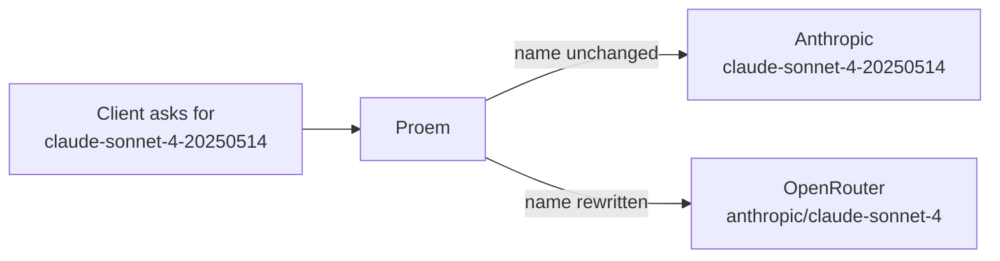

A member is one endpoint that Proem can route to. Proem validates the pool file
when it loads it and again after every change. If a change fails validation,
Proem reports the error and keeps the pool that is already running.

```yaml
members:
  - id: anthropic
    type: anthropic_api
    cred: { env: ANTHROPIC_API_KEY }
    baseURL: https://api.anthropic.com
    weight: 3

  - id: openrouter
    type: openrouter
    cred: { file: /run/secrets/openrouter }
    baseURL: https://openrouter.ai/api/v1
    weight: 1
    cooldownSec: 60
    modelMap:
      claude-sonnet-4-20250514: anthropic/claude-sonnet-4

  - id: retired
    type: generic
    cred: { env: OLD_KEY }
    baseURL: https://gateway.internal
    enabled: false
```

## Fields

| Field | Meaning |
|---|---|
| `id` | The name of the member. It must be unique. It becomes the `member` label on metrics. |
| `type` | How Proem sends the credential. See the table below. |
| `cred` | Where Proem reads the credential. Use `env:` or `file:`. The credential itself is never in this file. |
| `baseURL` | The address of the member. It must use `https://`. |
| `weight` | The share of requests this member receives. The default is `1`. A weight of `0` means Proem never selects it. |
| `enabled` | The default is true. Set it to `false` to keep the entry and stop routing to it. |
| `cooldownSec` | How long Proem skips this member after a rate limit. |
| `modelMap` | Model names to rewrite for this member. |

## Credential types

| `type` | Header that Proem sends |
|---|---|
| `anthropic_api` | `x-api-key: <credential>` |
| `anthropic_oauth` | `Authorization: Bearer <credential>` and the OAuth beta header |
| `openrouter`, `deepseek`, `generic` | `Authorization: Bearer <credential>` |

Select the type that the member expects. Use `generic` for a gateway that you
host, or for a third-party Anthropic-compatible gateway that reads a bearer
token.

## Model mapping

Members use different names for the same model. `modelMap` rewrites the `model`
field for one member, so a client can always ask for the same name.



Proem rewrites the name only for a member that maps it. Every other member
receives the name that the client sent.

## File format

You can write the pool file as YAML or as JSON. YAML 1.2 includes JSON, so
Proem parses a JSON document in the same way. It applies the same validation,
the same defaults and the same reload. The file extension has no effect.

```json
{"members":[{"id":"anthropic","type":"anthropic_api",
  "cred":{"env":"ANTHROPIC_API_KEY"},
  "baseURL":"https://api.anthropic.com","weight":3}]}
```

## Reload

Save the file. Proem applies the change to the next request. You do not restart
Proem, and Proem does not drop a connection.

To confirm that Proem applied the change:

```bash
curl -s localhost:9090/metrics | grep proem_config_reloads_total
```

Proem rejects a duplicate `id`, a missing credential, and a base URL that is
not HTTPS. When Proem rejects a change, it increases the counter with
`result="error"`, logs the reason, and keeps the running pool. A mistake in the
file cannot stop the proxy.

## Remove a member

You have two options:

1. Set `enabled: false`. Proem keeps the record and stops routing to the
   member.
2. Delete the entry.

Metrics keep the old `member` label in both cases, so past usage stays
attributed.
