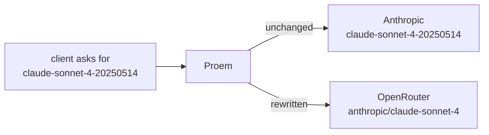

A pool member is one upstream Proem may route to. The file is validated on
load and on every change; an edit that fails validation is reported and the
previous pool stays in force.

```yaml
members:
  - id: anthropic
    type: anthropic_api
    cred: { env: ANTHROPIC_API_KEY }
    baseURL: https://api.anthropic.com
    weight: 3

  - id: openrouter
    type: openrouter
    cred: { file: /run/secrets/openrouter }
    baseURL: https://openrouter.ai/api/v1
    weight: 1
    cooldownSec: 60
    modelMap:
      claude-sonnet-4-20250514: anthropic/claude-sonnet-4

  - id: retired
    type: generic
    cred: { env: OLD_KEY }
    baseURL: https://gateway.internal
    enabled: false
```

| Field | Meaning |
|---|---|
| `id` | Unique, and the `member` label on metrics |
| `type` | How the credential is presented — see below |
| `cred` | `env:` or `file:`; the value itself is never in this file |
| `baseURL` | Must be `https://` |
| `weight` | Share of traffic, default `1`. `0` is allowed and means never chosen |
| `enabled` | Default true. `false` keeps the entry but excludes it from routing |
| `cooldownSec` | How long to skip this member after a rate limit |
| `modelMap` | Rewrites the `model` field on the way out |

## Credential types

| `type` | Header sent |
|---|---|
| `anthropic_api` | `x-api-key: <cred>` |
| `anthropic_oauth` | `Authorization: Bearer <cred>` plus the OAuth beta header |
| `openrouter`, `deepseek`, `generic` | `Authorization: Bearer <cred>` |

Pick the one that matches what the upstream expects. `generic` is the right
choice for a self-hosted or third-party Anthropic-compatible gateway that
authenticates with a plain bearer token.

## Model mapping

Different providers name the same model differently. `modelMap` rewrites the
`model` field per member, so a client can keep asking for one name:



Only members with a mapping for that name rewrite it; everyone else forwards
the model as given.

## File format

The pool may be written as YAML or JSON. YAML 1.2 is a superset of JSON, so a
JSON document is parsed identically — same validation, same defaults, same hot
reload. The extension carries no meaning.

```json
{"members":[{"id":"anthropic","type":"anthropic_api",
  "cred":{"env":"ANTHROPIC_API_KEY"},
  "baseURL":"https://api.anthropic.com","weight":3}]}
```

## Hot reload

Save the file. The change applies to the next request; there is no restart and
no dropped connection. Watch it land:

```bash
curl -s localhost:9090/metrics | grep proem_config_reloads_total
```

A rejected edit — a duplicate id, a missing credential, a non-HTTPS URL —
increments `result="error"`, logs the reason, and leaves the running pool
untouched. A typo cannot take the proxy down.

## Removing a member

Set `enabled: false` to stop routing to it while keeping the record, or delete
the entry outright. Historical metrics keep the old `member` label either way,
so past usage stays attributable.
