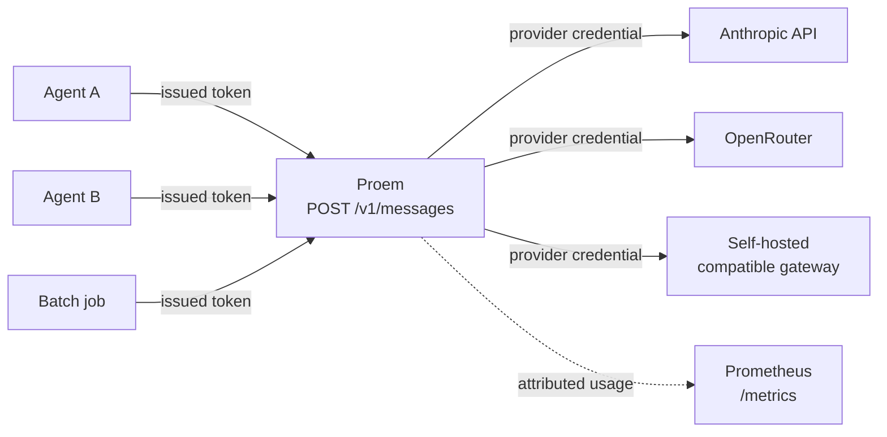

Proem is a reverse proxy that speaks the Anthropic Messages API. Your clients
point at Proem instead of an upstream provider, and Proem authenticates the
caller, selects a healthy upstream from a configured pool, injects that
upstream's credential, and records what the request consumed — attributed to
the caller that made it.

Anything that talks to an Anthropic-compatible endpoint works unchanged: the
Anthropic SDKs, the Claude Agent SDK, Claude Code, or your own HTTP client. It
is a `ANTHROPIC_BASE_URL` change, nothing more.

## The shape of it

A caller never holds a provider credential. It presents a token Proem issued,
which is valid only against Proem. Proem swaps it for the pooled credential of
whichever upstream it routes to.

## What it is for

**One endpoint over several providers.** A pool can mix the Anthropic API with
any Anthropic-compatible gateway — OpenRouter, DeepSeek, a self-hosted
deployment. Per-member model mapping rewrites model names so a client can keep
asking for the same model regardless of who serves it.

**Credentials that stay put.** Provider keys live in Proem's configuration,
read from environment variables or files. Callers get their own issued tokens,
revocable individually, without redistributing anything.

**Usage you can attribute.** Every request is labelled with the client that
made it, so `sum by (client) (increase(proem_tokens_total[24h]))` answers who
consumed what — including cache reads and cache writes, which dominate a cached
workload and are easy to miss.

**Failover that does not break streaming.** When an upstream returns a rate
limit or an overload, Proem puts it on a cooldown and retries the next member.
Responses that cannot fail over are streamed straight through, unbuffered, so a
streaming client still sees tokens as they are produced.

## What it is not

Proem does not change the terms you have with any provider. It is a routing and
accounting layer for capacity you are already entitled to use: it holds the
credentials you configure and sends requests to the endpoints you name. Whether
a given credential may be used for a given workload is between you and that
provider.

It is also not a model gateway in the translation sense. Proem speaks the
Anthropic Messages API and forwards it; it does not convert between provider
API shapes.

## Next

- [Quickstart](start/quickstart.md) — running in about five minutes
- [How it works](start/how-it-works.md) — the request path, end to end
- [Pool members](guides/pool-members.md) — adding and weighting upstreams
- [Client tokens](guides/client-tokens.md) — issuing, revoking, attributing
