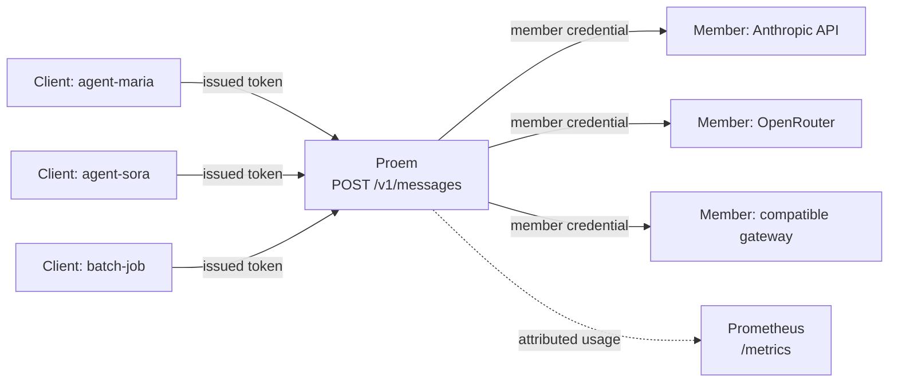

Proem is a reverse proxy that speaks the Anthropic Messages API. Your clients
send requests to Proem instead of to a provider. Proem authenticates the
client, selects a healthy member from a configured pool, adds that member's
credential, and records what the request used.

Any software that calls an Anthropic-compatible endpoint works without change.
This includes the Anthropic SDKs, the Claude Agent SDK, Claude Code, and your
own HTTP client. You change one setting, `ANTHROPIC_BASE_URL`.

## Terms

Three words have an exact meaning in this documentation.

- **Client**: a caller that Proem authenticates. Each client has a name and a
  token. The name becomes the `client` label on metrics.
- **Member**: one entry in the pool. A member has a credential and a base URL.
- **Pool**: the set of members that Proem can route to.

## The shape of it

A client never holds a member credential. A client sends a token that Proem
issued. That token works only against Proem. Proem replaces it with the
credential of the member it selects.

## What Proem does

**It puts one endpoint in front of several members.** A pool can contain the
Anthropic API and any Anthropic-compatible gateway. Examples are OpenRouter,
DeepSeek, and a gateway you host. Each member can map model names, so a client
can ask for one model name whatever member answers.

**It keeps credentials in one place.** Member credentials stay in Proem's
configuration. Proem reads them from environment variables or from files.
Clients get their own tokens. You can revoke one client without changing the
others.

**It attributes usage.** Proem labels each request with the client that sent
it. The query `sum by (client) (increase(proem_tokens_total[24h]))` reports
what each client used. The count includes cache reads and cache writes. On a
cached workload these are larger than the input and output counts.

**It fails over without stopping a stream.** A member can report a rate limit
or an overload. Proem then puts that member in cooldown and tries the next one.
Proem sends a response that cannot fail over straight to the client. It does
not buffer that response, so a streaming client receives tokens as the member
produces them.

## What Proem does not do

Proem does not change the terms of your agreement with a provider. Proem sends
requests to the endpoints you configure, with the credentials you supply. Your
agreement with a provider decides whether a credential may serve a workload.

Proem does not translate between API shapes. It speaks the Anthropic Messages
API and forwards it.

## Next

1. [Quickstart](start/quickstart.md) explains how to run Proem.
2. [How it works](start/how-it-works.md) explains the path of a request.
3. [Pool members](guides/pool-members.md) explains how to add a member.
4. [Client tokens](guides/client-tokens.md) explains how to issue a token.
