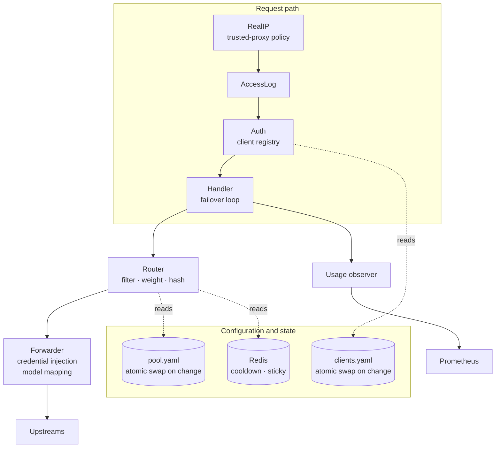

Proem is a single Go binary with no local state. Every instance reads the same
configuration files and shares cooldown state through Redis, so instances are
interchangeable and can be scaled horizontally behind a load balancer.

## Components

| Package | Responsibility |
|---|---|
| `pool` | Loads and validates the member list; atomic pointer swap on change |
| `client` | The client registry, keyed by token digest; issues new tokens |
| `clientip` | Resolves the caller's address under a trusted-proxy policy |
| `router` | Filters disabled and cooled members, then weighted hash or random |
| `failover` | Decides whether a response should be retried, and for how long to cool |
| `proxy` | Auth, access log, credential injection, the failover loop, usage observation |
| `store` | Redis wrapper for cooldown and sticky state; fails open |
| `metrics` | Prometheus collectors |
| `app` | Wiring, health and preflight routes, graceful shutdown |

## Configuration reloads

Both config files are watched. A change is parsed and validated before it is
adopted; on success the new value is swapped in atomically, and readers in
flight keep using the value they started with. On failure the previous
configuration stays in force and the error is logged and counted.

## State

The only shared state is Redis, holding two kinds of key:

- `cooldown:{member}` with a TTL, written when a member is rate limited
- `sticky:{session}` with a TTL, only in `redis` stickiness mode

Both are advisory. If Redis is unreachable Proem fails open: every member is
treated as healthy and stickiness is skipped. Routing quality degrades; traffic
does not stop.

## Horizontal scaling

Instances share nothing but Redis and the configuration files. With
`--sticky-mode lb` even Redis is optional for session affinity, since the
member is chosen by hashing the session id — every instance makes the same
choice for the same session without coordinating.
