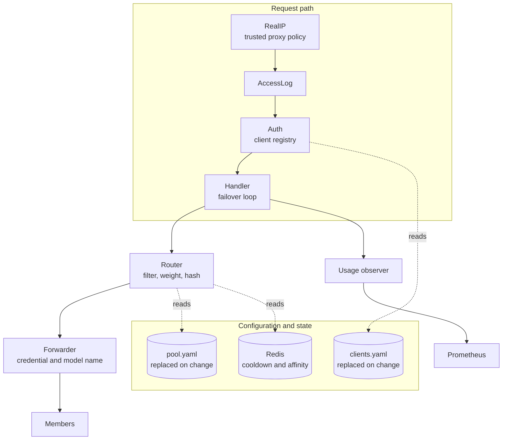

Proem is one Go binary. It keeps no state on local disk. Every instance reads
the same configuration files and shares cooldown state through Redis. The
instances are therefore interchangeable, and you can run several of them behind
a load balancer.

## Packages

| Package | Responsibility |
|---|---|
| `pool` | Loads and validates the member list. Replaces the active pool in one atomic step. |
| `client` | Holds the client registry, keyed by token digest. Issues new tokens. |
| `clientip` | Finds the address of the client under the trusted proxy policy. |
| `router` | Removes disabled and cooled members. Selects one by weighted hash or at random. |
| `failover` | Decides whether Proem retries a response, and how long the member stays in cooldown. |
| `proxy` | Authentication, access log, credential injection, the failover loop, and usage observation. |
| `store` | The Redis client for cooldown and affinity state. It fails open. |
| `metrics` | The Prometheus collectors. |
| `app` | Startup, the health and preflight routes, and shutdown. |

## Configuration reload

Proem watches both configuration files. When a file changes, Proem parses and
validates the new content before it uses it.

If validation passes, Proem replaces the active value in one atomic step. A
request that is already running keeps the value that it started with.

If validation fails, Proem keeps the active value. It logs the reason and
increases `proem_config_reloads_total{result="error"}`.

## State

Redis is the only shared state. Proem writes two kinds of key:

- `cooldown:{member}`, with a time to live. Proem writes it when a member
  reports a rate limit.
- `sticky:{session}`, with a time to live. Proem writes it only in `redis`
  affinity mode.

Both keys are advisory. If Redis is not available, Proem fails open: it treats
every member as healthy and skips session affinity. Routing becomes less
accurate. Traffic continues.

## Running several instances

Instances share the configuration files and Redis. Nothing else.

In `--sticky-mode lb` the instances do not need Redis for session affinity.
Each instance hashes the session identifier, so every instance selects the same
member for the same session without any exchange between them.
