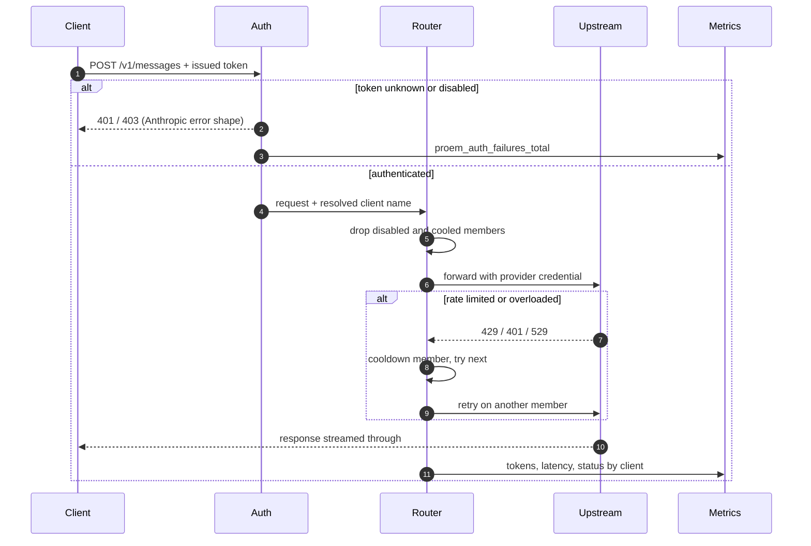
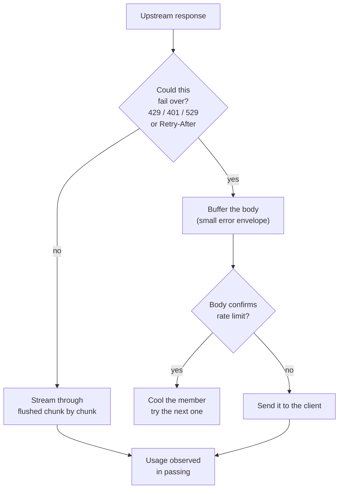

## Two layers of credentials

Proem sits between two independent credentials, and keeping them apart is the
point of the design.

| | Held by | Checked against |
|---|---|---|
| **Client token** | the calling agent | `clients.yaml` digests |
| **Provider credential** | Proem | the upstream provider |

The client token is authenticated and then **removed** from the request; the
provider credential is injected in its place. A leaked client token grants
nothing beyond this proxy, and revoking one is a single line of config.

## The request path

## Selecting a member

The router drops members that are disabled or in cooldown, then picks from
what remains. With a session identifier present it hashes it, so the same
session keeps landing on the same member; otherwise it picks at random.
Selection is weighted, so a member with `weight: 4` receives roughly four times
the traffic of a `weight: 1` peer.

Stickiness has three modes. `lb` hashes the session id and needs no shared
state. `redis` pins a session to a member in Redis. `none` disables it.

## Failover, and why streaming still works

Failover has to inspect a response before deciding to retry, but bytes already
sent to a client cannot be recalled. Proem therefore decides from the status
and headers **before** committing anything:

A response that cannot fail over is copied straight through and flushed as it
arrives, so a streaming client sees tokens as they are produced. Once streaming
has begun the response is committed: an error arriving mid-stream is passed to
the client rather than retried, because the client has already seen part of the
answer.

## Cooldown

When a member is rate limited it is written to Redis with a TTL, and the router
skips it until that expires. The TTL comes from the response's `Retry-After`
when present, otherwise the member's `cooldownSec`, otherwise a default.

If Redis is unavailable Proem fails open: every member is considered healthy
and stickiness is skipped, so a Redis outage degrades routing quality rather
than stopping traffic.

## Accounting

A usage observer reads the response as it is copied, without altering or
delaying it. It understands both shapes — a single JSON body, and an event
stream — so accounting does not depend on whether the client asked to stream.

Providers disagree about which stream event carries which counter, so every
counter is merged from whichever event reports it, keeping the highest value
seen. Input, output, cache reads and cache writes are all recorded, labelled by
client and member.
