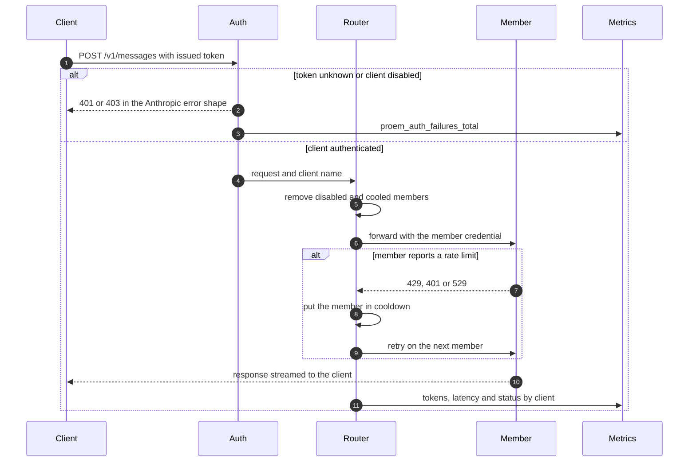
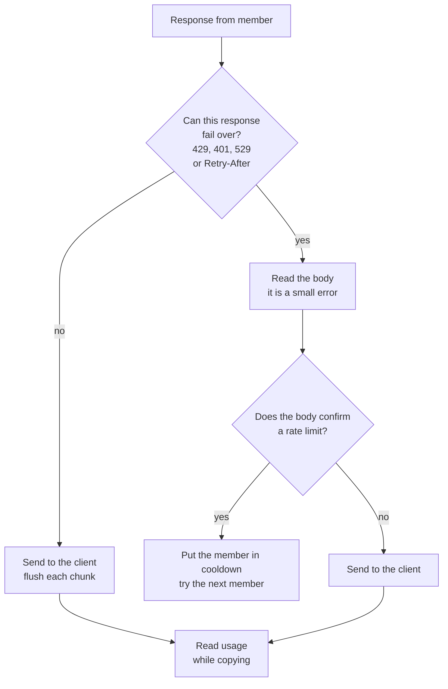

## Two credentials

Proem holds two credentials that must stay separate.

| Credential | Held by | Checked against |
|---|---|---|
| Client token | the client | the digests in `clients.yaml` |
| Member credential | Proem | the member |

Proem authenticates the client token and then removes it from the request. It
adds the member credential in place of it. A stolen client token gives access
to Proem only. To revoke that access, you change one line of configuration.

## The path of a request

## How Proem selects a member

The router first removes members that are disabled or in cooldown. It then
selects one of the members that remain.

If the request carries a session identifier, the router hashes it. The same
session then reaches the same member each time. If there is no session
identifier, the router selects at random.

Both methods respect weight. A member with `weight: 4` receives about four
times the requests of a member with `weight: 1`.

Session affinity has three modes:

- `lb` hashes the session identifier. It needs no shared state.
- `redis` stores the pinned member in Redis.
- `none` disables affinity.

## Failover and streaming

Failover must read a response before it decides to retry. Proem cannot recall
bytes that it already sent to the client. Proem therefore decides from the
status and the headers, before it sends anything.

Proem copies a response that cannot fail over straight to the client. It
flushes each chunk as it arrives, so a streaming client receives tokens as the
member produces them.

After a stream starts, Proem cannot fail over. It sends an error that arrives
in the middle of a stream to the client, because the client already has part of
the answer.

## Cooldown

When a member reports a rate limit, Proem writes a key to Redis with a time to
live. The router skips that member until the key expires.

Proem selects the time to live in this order:

1. The `Retry-After` header of the response, if the member sent one.
2. The `cooldownSec` field of the member.
3. A built-in default.

If Redis is not available, Proem fails open. It treats every member as healthy
and skips session affinity. A Redis outage lowers the quality of routing. It
does not stop traffic.

## Accounting

A usage observer reads the response while Proem copies it. The observer does
not change the bytes and does not delay them.

The observer reads both response shapes: a single JSON body, and an event
stream. Accounting therefore does not depend on whether the client asked to
stream.

Members disagree about which stream event carries which counter. The observer
therefore merges each counter from whichever event reports it, and keeps the
highest value it sees. It records input tokens, output tokens, cache reads and
cache writes, labelled by client and by member.
